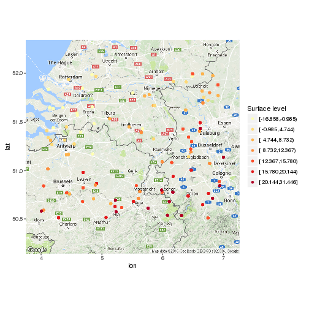

Water Quality in NW-Europe
========================================================
author: Hugo van den Berg
date: 16 October 2016
autosize: true
font-import: http://fonts.googleapis.com/css?family=Work+Sans+Light
font-family: 'Work Sans Light'

Introduction
========================================================

The `wells` dataset contains data for 100
wells, with up to 10 screens.
The wells data is a fictitious dataset generated to be within the north western
area of Europe, with random data for the quality parameters conductivity and
acidity.

To easily get a feel for the data a viewer was created.

Base plot
========================================================
Below is the code that plots the locations of the wells with their respective
surface level.
This takes some time to generate, so the background map is disabled in the app
by default.

```r
ggmap(get_map(
        location = c(left = min(wells$x),
                     right = max(wells$x),
                     bottom = min(wells$y),
                     top = max(wells$y)),
        scale = 2
        )) +
    geom_point(aes_string("x", "y", color = "cut2(z0, g = 7)"), data = wells) +
    scale_color_brewer("Surface level", type = "seq", palette = "YlOrRd")
```

Base plot (2)
========================================================



Summaries
========================================================
The app also builds a linear model to show linear relationships between spatial
coordinates and the selected parameter:

```r
data <- wells %>%
    filter(x >= input$x[1], x <= input$x[2],
           y >= input$y[1], y <= input$y[2],
           z >= input$z[1], z <= input$z[2]
    ) %>%
    select_("x", "y", cols[input$dataCol])
names(data) <- c("X-coordinate",
                 "Y-coordinate",
                 input$dataCol)
form <- as.formula(paste0("`", input$dataCol,
                          "` ~ `X-coordinate` + `Y-coordinate`"))
summary(lm(form, data))
```

Final notes
=========================================================

- To get more in depth with the data, visit the
[app](https://postwater.shinyapps.io/WaterQualityNWE/).
- The script to generate the data is listed on
[GitHub](https://github.com/Hugovdberg/ShinyPresentation/)
